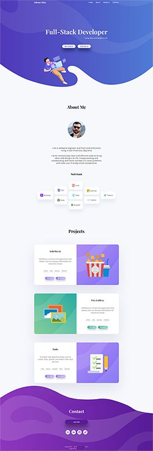

# Elegant Portfolio
This custom Portfolio is one of my favorite design/develop project for a number of reasons.
I have created, designed, and developed it myself as inspiration from [Figma](https://figma.com/) to deployment.

# Tech used
- 
- 
- 
- 
- 
- 

# Applied Concepts
- Semantic HTML5
- CSS3 variables
- Flex-box / Grid
- Color Scheme
- Typography
- Styled guide
- Images Optimization
- Font-awesome Icons
- Reusable components

# Snapshot

# Design Process
This portfolio project is first designed in Figma with the following steps:
  - Planned and sketch the layout with wire-frames
  - Converted wire-frame to block model
  - Added typography
  - Created color scheme to make the design elegant and modern looking
  - Created/designed blobs (large header and footer background graphics) 
  
Check out [Figma Design](https://www.figma.com/file/imEUdTg7CW2ZepsP6yfy4N/Untitled?node-id=0%3A1)

# Snapshots
